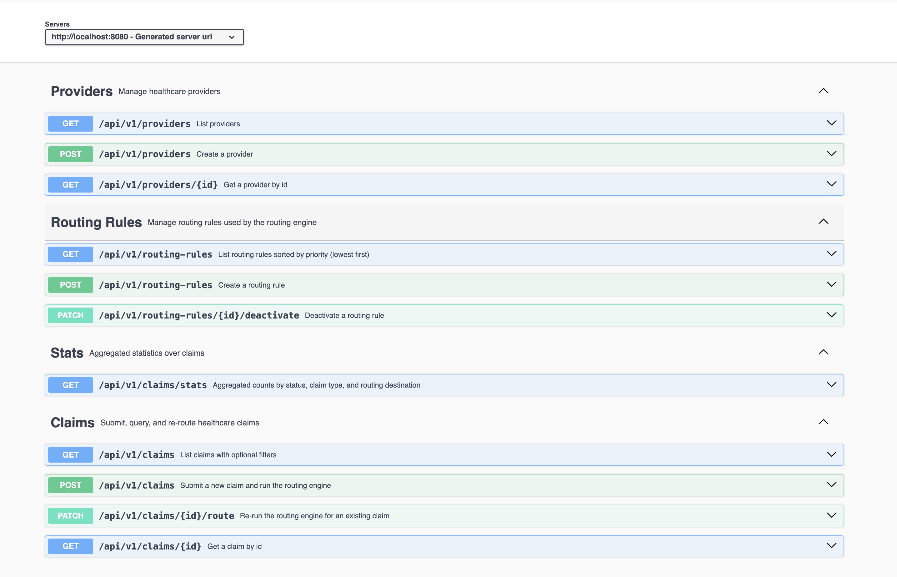
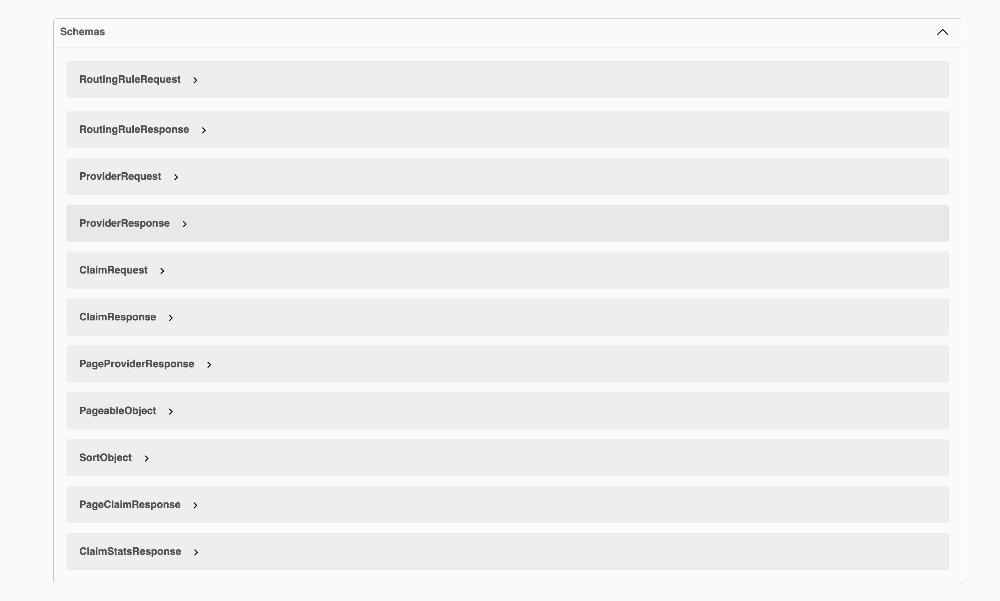
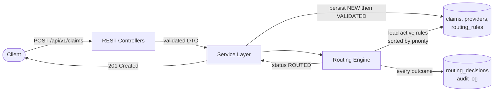
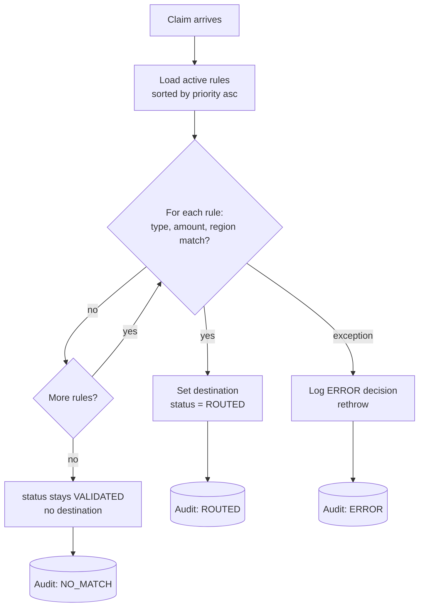
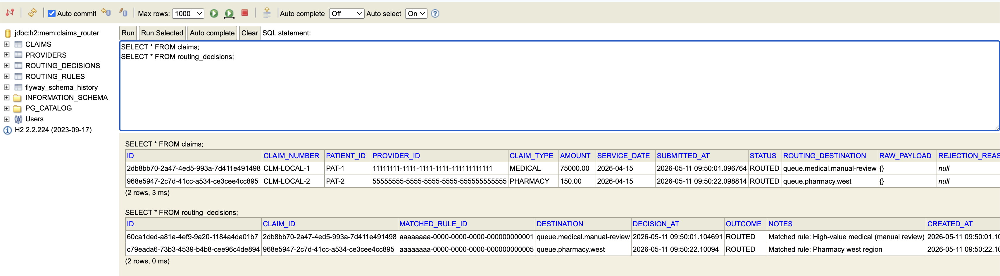

<div align="center">

# Claims Router

**A Spring Boot service that ingests healthcare claims, runs them through a configurable rules engine, and writes an immutable audit trail of every routing decision.**

[](https://openjdk.org/projects/jdk/17/)
[](https://spring.io/projects/spring-boot)
[](https://maven.apache.org/)
[](https://github.com/dhruv7539/claims-router/actions/workflows/ci.yml)
[](#license)

</div>

---

## Contents

- [Why this exists](#why-this-exists)
- [API at a glance](#api-at-a-glance)
- [Architecture](#architecture)
- [Tech stack](#tech-stack)
- [Quick start](#quick-start)
- [API reference](#api-reference)
- [How the routing engine works](#how-the-routing-engine-works)
- [Project structure](#project-structure)
- [Testing](#testing)
- [Design decisions](#design-decisions)
- [Roadmap](#roadmap)
- [License](#license)

---

## Why this exists

In a healthcare interoperability platform, claims arrive from many upstream sources — clearinghouses, payer portals, partner integrations — and need to be dispatched to the right downstream system: a medical adjudication queue, a dental processor, a pharmacy benefits manager, a manual review queue for high-dollar claims, and so on. Hardcoding that logic doesn't scale because the rules change every time a new partner contract comes online or a threshold shifts.

This service models that domain end-to-end. It accepts a claim payload, validates it (NPI format, amount range, dates, required fields), persists it, and then runs a small in-process routing engine that walks active rules in priority order to decide where the claim should go. Every decision — matched, no-match, or error — is written to an immutable audit table so operations and compliance always have a clear answer to *"why did this claim end up here?"*.

The codebase is intentionally laid out the way a backend service at a healthcare data company tends to look: thin controllers, transactional services, Flyway-managed schema, DTOs separate from entities, validation at the edge, and a CI pipeline that runs the full test suite on every push.

---

## API at a glance

Ten endpoints across four resource groups, fully documented via OpenAPI and explorable in Swagger UI:



<details>
<summary><b>View generated schemas</b> (click to expand)</summary>



</details>

---

## Architecture

### Request flow



### Routing engine decision flow



A deeper write-up lives in [`docs/architecture.md`](docs/architecture.md).

---

## Tech stack

| Layer | Choice | Why |
|---|---|---|
| Language / runtime | Java 17 | Records, pattern matching, sealed types, modern stdlib |
| Web framework | Spring Boot 3.2 | Production-grade HTTP, validation, DI, configuration |
| Persistence | Spring Data JPA + Hibernate 6 | Repositories without boilerplate, criteria API for filters |
| Database | H2 (dev / test), PostgreSQL (prod) | Zero-setup local dev; same SQL works in both |
| Schema migrations | Flyway | Versioned, repeatable, runs on startup |
| DTO ↔ entity mapping | MapStruct | Compile-time generated, zero reflection |
| Boilerplate reduction | Lombok | Getters, builders, constructors without 300 lines of noise |
| Validation | Jakarta Bean Validation | Declarative `@NotBlank`, `@Positive`, `@Pattern` |
| API docs | SpringDoc OpenAPI | Swagger UI generated from controllers |
| Observability | Spring Boot Actuator | `/health`, `/info`, `/metrics` |
| Testing | JUnit 5 · Mockito · MockMvc · Spring Boot Test | Unit + slice + full-context |
| Build | Maven 3.9 | Standard, predictable, IDE-friendly |
| CI | GitHub Actions | Runs `mvn verify` on every push and PR |

---

## Quick start

### Prerequisites

- JDK 17+
- Maven 3.9+

### Run it

```bash
git clone https://github.com/<your-username>/claims-router.git
cd claims-router
mvn spring-boot:run
```

The app starts on **port 8080** with the `dev` profile and an in-memory H2 database. Flyway runs `V1__initial_schema.sql` and `V2__seed_data.sql` automatically, so 5 providers and 6 routing rules are loaded out of the box.

### Useful URLs

| Resource | URL |
|---|---|
| Swagger UI | <http://localhost:8080/swagger-ui.html> |
| OpenAPI JSON | <http://localhost:8080/v3/api-docs> |
| H2 console | <http://localhost:8080/h2-console> |
| Health check | <http://localhost:8080/actuator/health> |

**H2 console credentials:** JDBC URL `jdbc:h2:mem:claims_router`, user `sa`, password *(blank)*.

---

## API reference

| Method | Path | Purpose |
|---|---|---|
| `POST` | `/api/v1/claims` | Submit a new claim and run the routing engine |
| `GET` | `/api/v1/claims/{id}` | Get a claim by id |
| `GET` | `/api/v1/claims` | List claims with optional filters (`status`, `claimType`, `patientId`) |
| `PATCH` | `/api/v1/claims/{id}/route` | Re-run the routing engine for an existing claim |
| `GET` | `/api/v1/claims/stats` | Aggregated counts by status, type, and destination |
| `POST` | `/api/v1/providers` | Create a provider |
| `GET` | `/api/v1/providers/{id}` | Get a provider by id |
| `GET` | `/api/v1/providers` | List providers (paged) |
| `POST` | `/api/v1/routing-rules` | Create a routing rule |
| `GET` | `/api/v1/routing-rules` | List routing rules sorted by priority |
| `PATCH` | `/api/v1/routing-rules/{id}/deactivate` | Deactivate a routing rule |

<details>
<summary><b>Submit a claim — request &amp; response</b></summary>

**Request:**

```bash
curl -X POST http://localhost:8080/api/v1/claims \
  -H 'Content-Type: application/json' \
  -d '{
    "claimNumber":  "CLM-0001",
    "patientId":    "PAT-42",
    "providerNpi":  "1000000001",
    "claimType":    "MEDICAL",
    "amount":       75000.00,
    "serviceDate":  "2026-04-15",
    "rawPayload":   "{\"source\":\"clearinghouse-A\"}"
  }'
```

**Response — `201 Created`:**

```json
{
  "id": "2db8bb70-2a47-4ed5-993a-7d411e491498",
  "claimNumber": "CLM-0001",
  "patientId": "PAT-42",
  "providerId": "11111111-1111-1111-1111-111111111111",
  "providerNpi": "1000000001",
  "providerName": "Sunset Medical Group",
  "claimType": "MEDICAL",
  "amount": 75000.00,
  "serviceDate": "2026-04-15",
  "submittedAt": "2026-05-11T09:50:01.096764",
  "status": "ROUTED",
  "routingDestination": "queue.medical.manual-review",
  "createdAt": "2026-05-11T09:50:01.093698",
  "updatedAt": "2026-05-11T09:50:01.101832"
}
```

</details>

<details>
<summary><b>Validation failure — request &amp; response</b></summary>

**Request:** (deliberately invalid)

```bash
curl -X POST http://localhost:8080/api/v1/claims \
  -H 'Content-Type: application/json' \
  -d '{
    "claimNumber":  "",
    "patientId":    "",
    "providerNpi":  "abc",
    "amount":       -1,
    "rawPayload":   ""
  }'
```

**Response — `400 Bad Request`:**

```json
{
  "timestamp": "2026-05-11T09:51:26.259153",
  "status": 400,
  "error": "Bad Request",
  "message": "Validation failed",
  "path": "/api/v1/claims",
  "fieldErrors": [
    { "field": "providerNpi", "message": "providerNpi must be a 10-digit NPI" },
    { "field": "claimNumber", "message": "must not be blank" },
    { "field": "amount",      "message": "must be greater than 0" },
    { "field": "serviceDate", "message": "must not be null" },
    { "field": "claimType",   "message": "must not be null" },
    { "field": "patientId",   "message": "must not be blank" },
    { "field": "rawPayload",  "message": "must not be blank" }
  ]
}
```

</details>

<details>
<summary><b>Aggregated stats — request &amp; response</b></summary>

**Request:**

```bash
curl http://localhost:8080/api/v1/claims/stats
```

**Response — `200 OK`:**

```json
{
  "totalClaims": 2,
  "countsByStatus": { "ROUTED": 2 },
  "countsByClaimType": { "MEDICAL": 1, "PHARMACY": 1 },
  "countsByDestination": {
    "queue.medical.manual-review": 1,
    "queue.pharmacy.west": 1
  }
}
```

</details>

<details>
<summary><b>Create a routing rule — request &amp; response</b></summary>

**Request:**

```bash
curl -X POST http://localhost:8080/api/v1/routing-rules \
  -H 'Content-Type: application/json' \
  -d '{
    "name":        "Vision claims east region",
    "claimType":   "VISION",
    "region":      "EAST",
    "destination": "queue.vision.east",
    "priority":    25,
    "active":      true
  }'
```

**Response — `201 Created`** returns the persisted rule with its generated `id`, `createdAt`, and `updatedAt`. The routing engine's in-memory cache is evicted automatically, so the new rule is live on the very next claim submission.

</details>

---

## How the routing engine works

The engine loads every active rule sorted by `priority ASC` and walks them top-to-bottom. The **first** rule whose conditions all match wins. A condition is "matched" if the rule's field is `null` (wildcard) or equal to the claim's value (claim type, region) or — for `minAmount` / `maxAmount` — the claim's amount falls inside the range.

### Seeded rules

| Priority | Name | Claim type | Amount range | Region | Destination |
|---:|---|---|---|---|---|
| 10 | High-value medical (manual review) | MEDICAL | ≥ $50,000 | * | `queue.medical.manual-review` |
| 20 | Behavioral health | BEHAVIORAL_HEALTH | * | * | `queue.behavioral.standard` |
| 30 | Dental claims | DENTAL | * | * | `queue.dental.standard` |
| 40 | Vision claims | VISION | * | * | `queue.vision.standard` |
| 50 | Pharmacy west region | PHARMACY | * | WEST | `queue.pharmacy.west` |
| 100 | Default medical | MEDICAL | * | * | `queue.medical.standard` |

### Worked example

A `MEDICAL` claim for **$75,000** from a provider in the `WEST` region arrives:

1. Priority **10** — *High-value medical*. Type matches, amount ≥ $50,000 matches, region wildcard matches. **Match → wins.** Destination: `queue.medical.manual-review`.
2. Rules at priority 20–100 are not evaluated. The claim is updated to status `ROUTED` and a `RoutingDecision` row is appended with outcome `ROUTED` and a reference to rule #10.

A `PHARMACY` claim for **$150** from a `WEST`-region provider arrives:

1. Priorities 10 / 20 / 30 / 40 — type doesn't match, skipped.
2. Priority **50** — *Pharmacy west region*. Type matches, region matches. **Match → wins.** Destination: `queue.pharmacy.west`.

### The audit log proves it

After running both claims through, the `routing_decisions` table contains one row per evaluation — including the matched rule id and a human-readable note:



Notice that *every* claim has *exactly one* audit row, the `matched_rule_id` is recorded, and the outcome is enumerated (`ROUTED` here, but it would be `NO_MATCH` or `ERROR` in other cases). This is what compliance asks for six months later when someone needs to know *why* a specific claim was routed where it was.

---

## Project structure

```
claims-router/
├── pom.xml
├── README.md
├── docs/
│   ├── architecture.md
│   └── images/
├── .github/workflows/ci.yml
├── src/main/java/com/dhruv/claimsrouter/
│   ├── ClaimsRouterApplication.java
│   ├── config/        # JPA auditing, OpenAPI
│   ├── controller/    # Claim, Provider, RoutingRule, Stats
│   ├── service/       # interface + impl per domain
│   ├── repository/    # Spring Data JPA repositories
│   ├── mapper/        # MapStruct mappers
│   ├── model/
│   │   ├── entity/    # JPA entities + BaseEntity
│   │   ├── dto/       # request / response records
│   │   └── enums/     # ClaimType, ClaimStatus, DecisionOutcome
│   └── exception/     # custom exceptions + GlobalExceptionHandler
├── src/main/resources/
│   ├── application.yml + application-{dev,test,prod}.yml
│   └── db/migration/  # V1__initial_schema.sql, V2__seed_data.sql
└── src/test/java/com/dhruv/claimsrouter/
    ├── service/       # ClaimService, RoutingService, RoutingRuleService
    ├── controller/    # MockMvc tests for ClaimController
    └── integration/   # full-context end-to-end test
```

---

## Testing

**29 tests across 5 files**, covering unit (services), slice (`@WebMvcTest` controllers), and full-context Spring Boot integration tests against the same migrations the production profile uses.

```bash
mvn test
```

```
[INFO] Tests run: 3, Failures: 0, Errors: 0  ClaimRoutingIntegrationTest
[INFO] Tests run: 4, Failures: 0, Errors: 0  ClaimControllerTest
[INFO] Tests run: 5, Failures: 0, Errors: 0  RoutingRuleServiceImplTest
[INFO] Tests run: 9, Failures: 0, Errors: 0  RoutingServiceImplTest
[INFO] Tests run: 8, Failures: 0, Errors: 0  ClaimServiceImplTest
[INFO] Tests run: 29, Failures: 0, Errors: 0
[INFO] BUILD SUCCESS
```

The integration test boots the full Spring context against an isolated H2 database, posts a claim, and asserts both the HTTP response and the persisted audit row. CI runs the same `mvn verify` command on every push.

---

## Design decisions

### 1. DTOs separate from entities

Entities reflect the database; DTOs reflect the API contract. Coupling them means a column rename leaks into the public API, or a new request field forces a schema change. MapStruct keeps the mapping mechanical and compile-time-checked, so there's no boilerplate cost to keeping them apart.

### 2. Rules engine over hardcoded routing

Destinations and thresholds for healthcare claims change every time a new partner onboards. A data-driven rules table lets an operator add a rule by inserting a row — no redeploy — and lets the team replay routing for historical claims after a rule change via `PATCH /claims/{id}/route`.

### 3. Append-only audit log

`routing_decisions` is never updated. Every evaluation — matched, no-match, or error — is a new row. This is non-negotiable in healthcare for compliance and post-incident analysis, and it makes *"why did this claim go here?"* a single-table query.

### 4. First-match-wins, sorted by priority

Simple to reason about and easy for operators to predict. If two rules could both match, the lower priority number wins. Evaluation is O(rules) per claim, which is fine for the small number of active rules a real-world tenant tends to maintain.

### 5. Cache active rules in process

Rules are read on every single claim, but they change rarely. `@Cacheable("activeRoutingRules")` keeps the rule list in memory; the cache is evicted explicitly whenever a rule is created or deactivated, so stale data is impossible.

### What changes for production scale

- **Caching** — swap `ConcurrentMapCacheManager` for Caffeine (sized, per-node) plus a pub/sub eviction message, or move the cache to Redis for tenant-scoped, larger rule sets.
- **Async processing** — the current submit endpoint runs validation, persistence, and routing in one transaction. At higher throughput, persist the claim synchronously and publish a `ClaimSubmitted` event to Kafka; a routing consumer drives the rest. The audit log stays the same.
- **Real downstream queues** — `routingDestination` is a string today. In production it would be a real Kafka topic / SQS queue / HTTP endpoint that a dispatcher publishes to.
- **Observability** — Micrometer metrics like `routing.decisions{outcome}`, JSON logs with claim ids in MDC, distributed tracing with OpenTelemetry, and per-destination latency dashboards.
- **Multi-tenancy** — providers and rules become tenant-scoped via a `tenant_id` column and a request-scoped tenant filter at the JPA layer.

---

## Roadmap

- [ ] Kafka integration for asynchronous routing
- [ ] Real downstream queue dispatchers (SQS / Kafka / HTTP webhooks)
- [ ] Prometheus + Grafana dashboards via Micrometer
- [ ] OAuth2 resource server with scope-based authorization
- [ ] Small admin UI for rule management

---

## License

[MIT](LICENSE) © Dhruv Bhanderi
