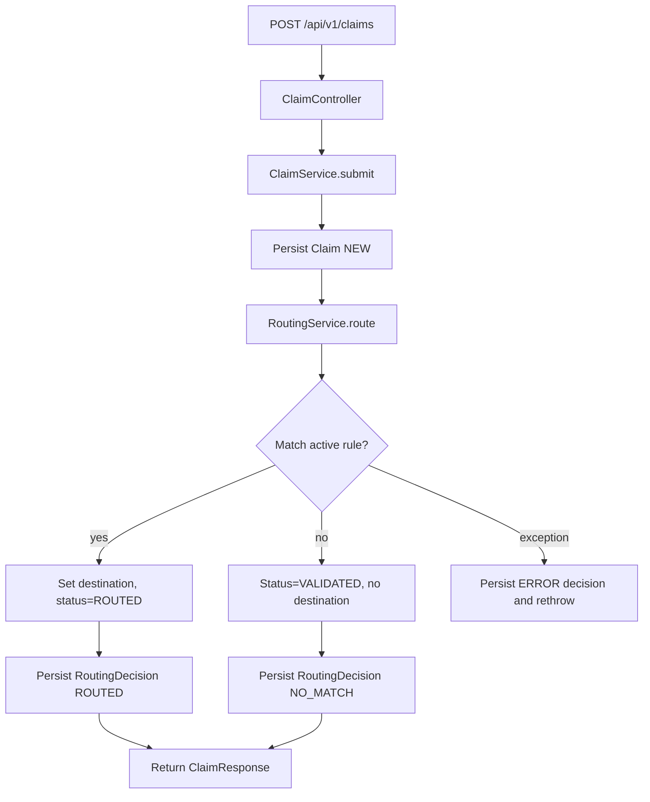

# Claims Router — Architecture

This document captures the high-level design decisions and the request flow
for a single claim submission.

## Layers

```
controller/   -- thin HTTP layer; validates and delegates
service/      -- business logic, transactions, orchestration
repository/   -- Spring Data JPA repositories
model/        -- entities, DTOs, enums
mapper/       -- MapStruct entity <-> DTO converters
exception/    -- custom exceptions + @ControllerAdvice
config/       -- Spring configuration (auditing, OpenAPI)
```

Controllers are intentionally thin. They accept validated DTOs, call the
service, and translate domain results to HTTP responses. Business rules
(rule matching, audit-logging, cache invalidation) live in services.

## Routing flow



## Why an audit log

Every decision the routing engine makes — match, no-match, error — is
appended to `routing_decisions`. This gives operators a complete history
for any claim. We can re-run the engine via `PATCH /claims/{id}/route`
without losing the original decision trail.

## Caching

Active rules are cached in-memory via Spring's `@Cacheable`. The cache
is evicted whenever a rule is created or deactivated, so we never serve
stale routing decisions from cache. The default in-memory cache is fine
for single-instance deployments. For multi-node, swap in Redis or
Caffeine + a pub/sub eviction signal.
